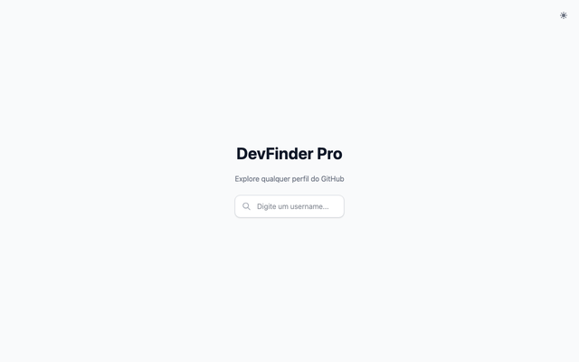
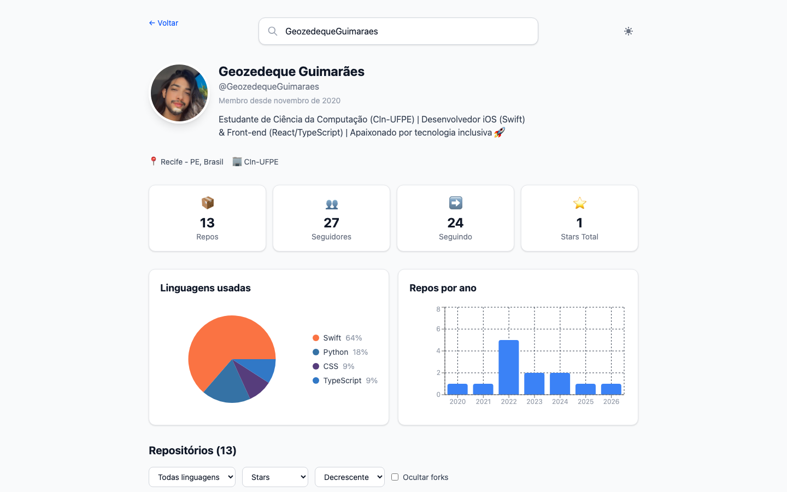
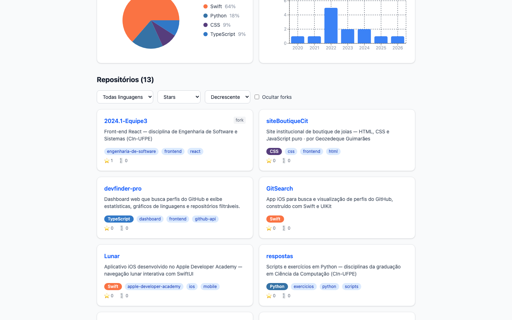
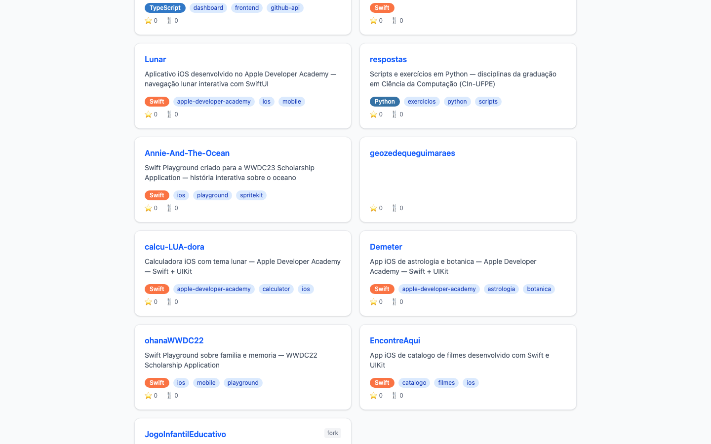

<div align="center">

# DevFinder Pro

### Dashboard web para busca de perfis do GitHub

[](https://react.dev)
[](https://www.typescriptlang.org)
[](https://vite.dev)
[](https://tailwindcss.com)

</div>

---

## Demo


---

## Sobre o Projeto

**DevFinder Pro** é um dashboard web que permite buscar qualquer perfil do GitHub e visualizar estatísticas detalhadas, gráfico de linguagens mais usadas e repositórios filtráveis — tudo em uma interface moderna e responsiva.

### Tela inicial


### Perfil do desenvolvedor



### Gráficos e repositórios



### Lista de repositórios



### Mobile

<p align="center">
  
  &nbsp;&nbsp;&nbsp;
  
</p>

---

## Funcionalidades

- Busca de perfis por username do GitHub
- Estatísticas do perfil — repos, seguidores, seguindo, stars totais
- Gráfico de linguagens (pie chart) com as top 5 linguagens
- Gráfico de repos por ano (bar chart)
- Repositórios filtráveis por linguagem, ordenação e forks
- Histórico de buscas recentes salvo no localStorage
- Dark/Light mode
- Design responsivo (desktop e mobile)
- Tratamento de erros (404, rate limit)

---

## Tecnologias

- **React 19** — biblioteca para construção da interface
- **TypeScript** — tipagem estática e segurança no desenvolvimento
- **Vite** — build tool rápida e moderna
- **Tailwind CSS** — estilização utilitária
- **Recharts** — gráficos interativos de linguagens
- **TanStack Query** — gerenciamento de estado e cache de requisições
- **Axios** — requisições HTTP para a GitHub REST API
- **Zustand** — gerenciamento de estado global
- **React Router DOM** — navegação entre páginas

---

## Estrutura do Projeto

```
devfinder-pro/
├── public/
└── src/
    ├── api/
    │   ├── githubClient.ts     # instância axios + token
    │   ├── userApi.ts          # busca de perfil do usuário
    │   ├── reposApi.ts         # listagem de repositórios
    │   └── types.ts            # tipagens da API
    ├── components/
    │   ├── charts/             # gráfico de linguagens e repos/ano
    │   ├── profile/            # header, stats e links do perfil
    │   ├── repos/              # lista, card e filtros de repos
    │   └── ui/                 # componentes reutilizáveis
    ├── hooks/                  # custom hooks (react-query, theme, debounce)
    ├── pages/
    │   ├── HomePage.tsx        # busca de usuário
    │   └── ProfilePage.tsx     # dashboard do perfil
    ├── store/                  # estado global (zustand)
    └── utils/                  # funções utilitárias
```

---

## Como Executar

1. Clone este repositório

```bash
git clone https://github.com/GeozedequeGuimaraes/devfinder-pro.git
```

2. Instale as dependências

```bash
npm install
```

3. Configure as variáveis de ambiente

```bash
cp .env.example .env
```

> Edite o arquivo `.env` e adicione seu token do GitHub:

```env
VITE_GITHUB_TOKEN=seu_token_aqui
```

4. Inicie o servidor de desenvolvimento

```bash
npm run dev
```

---

## Autor

<div align="center">

**Geozedeque Guimarães**

Estudante de Ciência da Computação — CIn-UFPE

[](https://github.com/GeozedequeGuimaraes)
[](https://linkedin.com/in/geozedeque-guimaraes)

</div>
